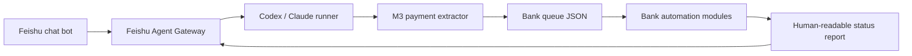

# Finance Automation Agent Suite

This repository is a sanitized portfolio snapshot of a Windows desktop finance automation system. It combines three cooperating projects:

- `m3-payment-extractor/`: extracts payment records from an OA/M3 finance report, validates fields, captures evidence, and routes records by payer bank.
- `feishu-agent-gateway/`: a Feishu bot gateway that receives chat commands, runs Codex or Claude Code tasks, handles screenshots/files, and reports automation failures back to users.
- `finance-bank-automation/`: bank-side automation modules for balance queries, maker-entry voucher creation, USB hub control, cross-project locking, and safe cleanup.

## Architecture



## What It Demonstrates

- End-to-end orchestration across chat, browser automation, data extraction, and bank-side GUI automation.
- Fail-closed validation for money movement workflows: missing bank, invalid account, invalid amount, missing screenshot, lock contention, and timeout states stop the flow.
- Production gates that distinguish test/fill-only mode from real maker-entry submission.
- Cross-project locking to prevent overlapping USB/UKey/bank-client operations.
- Human-readable failure reporting for finance users, while keeping local paths, stack traces, and secrets out of chat messages.
- Cleanup and retention rules for screenshots, logs, runtime queues, and temporary attachments.

## Safety Boundary

This is not a payment engine. The automation only supports data extraction, balance query, form filling, and maker-entry submission into a bank's review queue when explicit production switches are enabled. It does not perform final review, authorization, confirmation, or payment.

This public-facing copy is sanitized. Local `.env` files, runtime data, screenshots, bank debug runs, USB vendor binaries, build outputs, and other generated artifacts are intentionally excluded.

## Repository Map

```text
finance-automation-agent-suite/
  m3-payment-extractor/
  feishu-agent-gateway/
  finance-bank-automation/
```

Each subproject keeps its own README or skill documentation for operational details.
